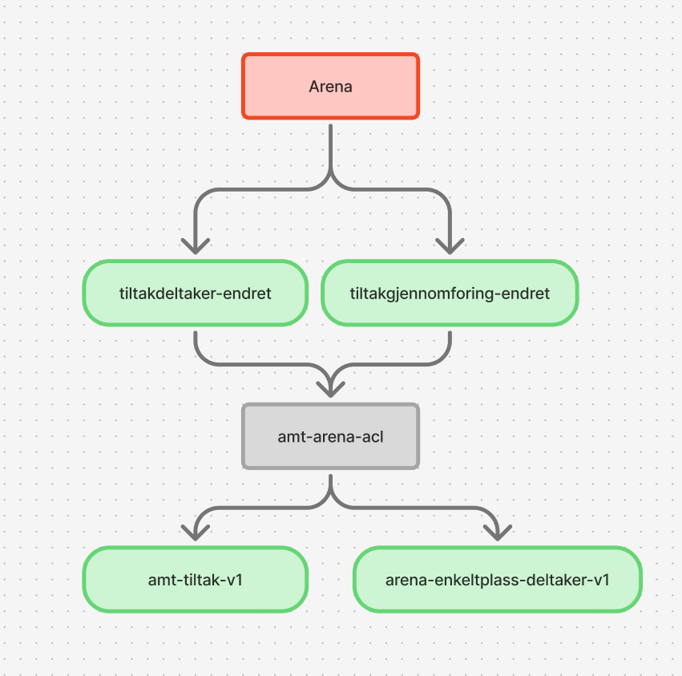

# amt-arena-acl
Tjeneste som leser data fra Arena og muterer de til AMT-Domene



## Data ingest
Leser data fra flere arena kafka topics, lagrer i arena_data tabellen sammen med status på konverteringen (til AMT domene).
Det kjøres schedulerte jobber i tabellen, som sletter eller reingester meldinger basert på statusen.
Data som kommer fra arena kan publiseres i ufullstendig format(at felter mangler) og dette tas høyde for i alle ingestorer.
Mapping mellom amt_id og arena_id ligger i arena_data_id_translation

### Deltaker ingest
Ingest av deltaker er avhengig av at en gjennomføring(fra arena) er ingestet. Derfor er det satt opp retry mekanismer som sørger for at dersom en gjennomføring ikke finnes på tidspunktet som en deltaker leses, så venter man på gjennomføringen.
Hovedoppgaven til deltaker ingestor er å mappe deltakeren fra arena domene

### Gjennomføring ingest
Det er tiltakstypen som bestemmer om deltakeren skal slettes. Dette er data som ligger på Gjennomføring objektet i arena.
Vi må lese gjennomføringer fra arena for å vite om
- vi har hjemmel til å lagre en deltaker som er koblet til gjennomføringen(utifra tiltakstype).
- om gjennomføringen er ansett som gyldig slik at deltakerene kan sendes videre.(om gjennomføringen ikke er gyldig så vil ikke disse deltakelsene kunne kobles senere i verdikjeden heller)
Vi lagrer minimal info om gjennomføringen i databasen for å gjøre det lettere å avgjøre om en gitt deltaker skal slettes eller ikke.

### Hist deltaker ingest
En hist deltaker er en historisert deltaker.
Vi leser hist deltakere fra arena. Dette er deltakere som er historisert fordi det har kommet en ny deltakelse på samme person og samme gjennomføring en gang til.
mapping som viser hvilke arenaid og arenahistid som er assosiert, ligger i arena_data_hist_id_translation sammen med amt_id

#### Migrering av hist deltakere
#### case 1
Vi da vi leste hist topic fra start, skulle alle deltakerene som lå der der **ikke** matche med noen av deltakerene vi har fra før av(fordi vi på forhånd ikke hadde lest deltakelsen fra tiltakdeltaker topicen, eller den var slettet pga en delete melding)
1. Vi har lest en deltaker
2. Vi mottar en hist_deltaker, denne vil ikke matche med en eksisterende deltaker, denne skal opprettes som ny og sendes videre

#### case 2
Vanlig usecase mens vi er i produksjon er at det kommer løpende data fra både hist og deltaker topic.
1. Vi får en deltaker med arenaid x
2. Deltakeren blir (sannsynligvis) avsluttet(fordi personen ikke kunne delta alikevell) => record på deltaker topic
3. Deltakeren blir påmeldt igjen etter en stund, fordi personen da har mulighet til å delta igjen
   => Deltakeren blir historisert i arena, flyttet til hist_tabellen med en ny arenaId(altså ikke x som tidligere i eksempelet)
   => Vi får DELETE record på deltakeren med arenaid x, denne skal kastes av oss
   => Vi får CREATED record på hist_deltaker med arenaid y, denne skal vi koble til eksisterende deltaker på arenaid x vha en sammenlikning av data
   => vi får CREATED record på ny deltaker z og samme person, denne skal vi lagre og sende videre

## Rekonstruere meldinger på kafka
For å rekonstruere meldinger med nye data så kan dette trigges ved å endre status på nyeste melding knyttet til arena objektet i arena_data tabellen.
Meldingene vil da plukkes opp av en schedulert jobb. 
```sql
WITH max_ids AS (
    select max(id) as max
    from arena_data
    where arena_table_name = 'SIAMO.TILTAKDELTAKER'
      and ingest_status = 'HANDLED'
    group by arena_id
)
update arena_data
set ingest_status  = 'RETRY',
    ingest_attempts = 0,
    last_attempted  = null
WHERE id in (SELECT max from max_ids);
```
Vær obs på at nye meldinger kan dukke opp underveis, mens retryprocessor prosesserer de gamle meldingene.
Det kan derfor være lurt å ta en sjekk etter at alle meldingene er prosessert og evt kjøre en update på de det gjelder
```sql
WITH max_ids AS (
    select arena_id, max(id) as id
    from arena_data
    where arena_table_name = 'SIAMO.TILTAKDELTAKER'
      and ingest_status = 'HANDLED'
    group by arena_id
), max_ingest AS (
    select distinct on (arena_id) arena_id, id
    from arena_data
    where arena_table_name = 'SIAMO.TILTAKDELTAKER'
      and ingest_status = 'HANDLED'
    order by arena_id, ingested_timestamp desc
), to_update AS (
    select max_ids.arena_id, max_ids.id as siste_melding_id, max_ingest.id as siste_ingestet
    from max_ids join max_ingest on max_ids.arena_id = max_ingest.arena_id
        and max_ids.id != max_ingest.id
)
select *
from to_update
```