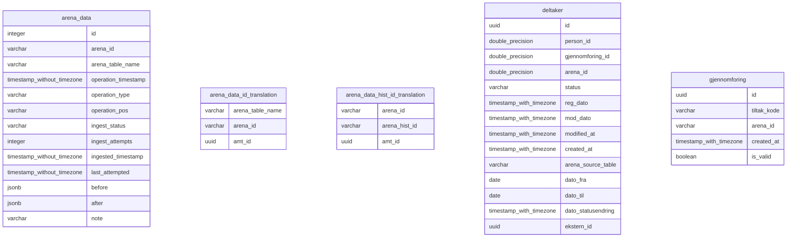

# amt-arena-acl
Tjeneste som leser data fra Arena og muterer de til AMT-Domene

## Ingest
Leser data fra arena kafka topics, lagrer i arena_data tabellen sammen med status på konverteringen til AMT domene.
Det kjøres schedulerte jobber i tabellen, som sletter eller reingester meldinger basert på statusen.


## Rekonstruere meldinger på kafka
For å rekonstruere meldinger med nye data så kan dette trigges ved å endre status på nyeste melding knyttet til arena objektet i arena_data tabellen.
Meldingene vil da plukkes opp av en schedulert jobb. 
```sql
WITH max_ids AS (
    select max(id) as max
    from arena_data
    where arena_table_name = 'SIAMO.TILTAKDELTAKER'
      and ingest_status = 'HANDLED'
    group by arena_id
)
update arena_data
set ingest_status  = 'RETRY',
    ingest_attempts = 0,
    last_attempted  = null
WHERE id in (SELECT max from max_ids);
```
Vær obs på at nye meldinger kan dukke opp underveis, mens retryprocessor prosesserer de gamle meldingene.
Det kan derfor være lurt å ta en sjekk etter at alle meldingene er prosessert og evt kjøre en update på de det gjelder
```sql
WITH max_ids AS (
    select arena_id, max(id) as id
    from arena_data
    where arena_table_name = 'SIAMO.TILTAKDELTAKER'
      and ingest_status = 'HANDLED'
    group by arena_id
), max_ingest AS (
    select distinct on (arena_id) arena_id, id
    from arena_data
    where arena_table_name = 'SIAMO.TILTAKDELTAKER'
      and ingest_status = 'HANDLED'
    order by arena_id, ingested_timestamp desc
), to_update AS (
    select max_ids.arena_id, max_ids.id as siste_melding_id, max_ingest.id as siste_ingestet
    from max_ids join max_ingest on max_ids.arena_id = max_ingest.arena_id
        and max_ids.id != max_ingest.id
)
select *
from to_update
```

## Om hist deltakere
Vi leser hist deltakere fra arena. Dette er deltakere som er historisert fordi det har kommet en ny deltakelse på samme person og samme gjennomføring en gang til.

### case 1
Vi leser hist topic fra start, alle deltakerene som ligger der skal da **ikke** matche med noen av deltakerene vi har fra før av(fordi vi på forhånd har lest tiltakdeltaker topicen)
1. Vi har lest en deltaker
2. Vi mottar en hist_deltaker, denne vil ikke matche med en eksisterende deltaker, denne skal opprettes som ny og sendes videre


### case 2
Vanlig usecase mens vi er i produksjon er at det kommer løpende data fra hist og deltaker topic.
1. Vi får en deltaker
2. Deltakeren blir (sannsynligvis) avsluttet(fordi personen ikke kunne delta alikevell) => record på deltaker topic
3. Deltakeren blir påmeldt igjen etter en stund, fordi personen da har mulighet til å delta igjen
   => Deltakeren blir historisert i arena, flyttet til hist_tabellen med en ny arenaId
   => Vi får DELETE record på deltakeren, denne skal kastes av oss
   => Vi får CREATED record på hist_deltaker, denne skal vi koble til eksisterende deltaker
   => vi får CREATED record på ny deltaker og samme person, denne skal vi lagre og sende videre

### Databasetabeller
